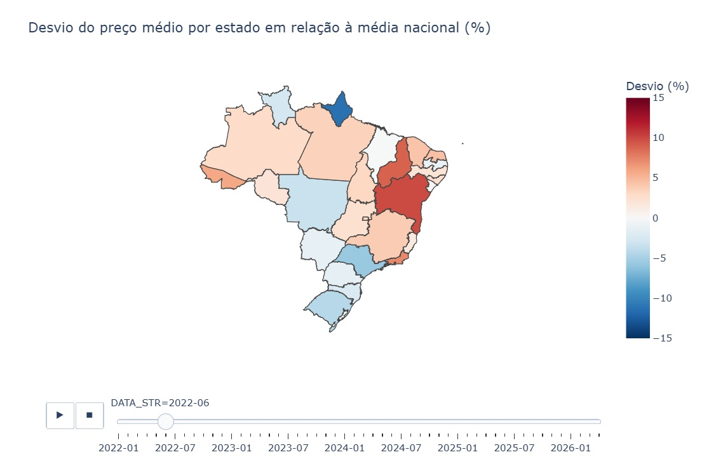

# 🛢️ EDA — Preços de Gasolina no Brasil (2022–2026)

Análise exploratória da série histórica de preços de gasolina no Brasil, com foco em padrões regionais e na relação com o mercado internacional de petróleo.

**Dados:** ANP (Agência Nacional do Petróleo) + Yahoo Finance | **960 mil+ registros** | **Jan/2022 – Mar/2026**

---

## Principais Achados

**Padrão geográfico persistente**
O Norte paga consistentemente mais caro — Acre e Roraima chegam a 15% acima da média nacional. O Amapá é uma anomalia positiva: apesar do isolamento geográfico, mantém preços abaixo da média, possivelmente por política tributária estadual.

**Rockets and feathers confirmado empiricamente**
Quando o Brent sobe, a gasolina brasileira acompanha em dias. Quando cai, não acompanha. Entre jan-mar 2025, o Brent caiu ~20% — a gasolina subiu.

**Repasse ficou mais rápido**
- Guerra na Ucrânia (2022): lag estimado de **8 dias**
- Tensão no Oriente Médio (2026): lag estimado de **4 dias**

**Heterogeneidade no repasse por estado**
O lag varia de 1 a 10 dias entre os estados — sem padrão geográfico claro, sugerindo que fatores tributários e de mercado local importam tanto quanto logística.

---

## Visualizações




---

## Estrutura do Repositório

```
├── 01_data_preparation.ipynb   # Coleta e limpeza dos dados brutos da ANP
├── 02_analysis.ipynb           # Análise exploratória completa
├── images/                     # Visualizações estáticas
└── data/                       # Instruções para reproduzir o dataset
```

---

## Como Reproduzir

1. Baixe os dados em [gov.br/anp](https://www.gov.br/anp) — Série Histórica de Preços de Combustíveis
2. Execute `01_data_preparation.ipynb` para gerar o dataset limpo
3. Execute `02_analysis.ipynb` para a análise completa

---

## Stack

Python · Pandas · Plotly · Seaborn · Scipy · yFinance

---

*Projeto de portfólio — Marcelo Eduardo | [LinkedIn](seu-link)*
